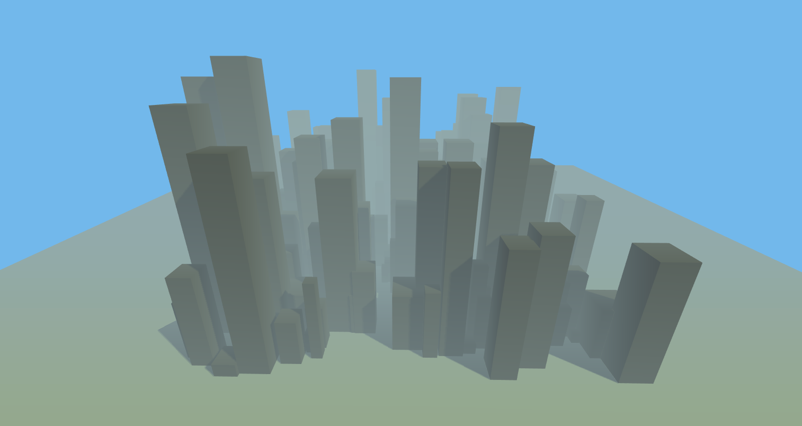

# three-city 🏗

Testing the library three.js 

#### 🕹️ Demo https://efrensanchez.github.io/three-city/

## ✋ Before Getting Started You Should…

    1. Have some JavaScript knowledge.
    2. Have some Three.js knowledge.

## ⭐ Getting Started

These instructions will get you a copy of the project up and running on your local machine for development and testing purposes. 

### 👉 Clone the repository to your machine

You can use git or download it directly from github

### 👉 Open `index.html` in your browser

## 🏗️ Built With

- [Three.js](https://threejs.org/) - The web library used

## 🖋️ Author

- **Efren Sanchez** - *Initial work* - [EfrenSanchez](https://github.com/EfrenSanchez)

## ©️ License

This project is licensed under the MIT License 
